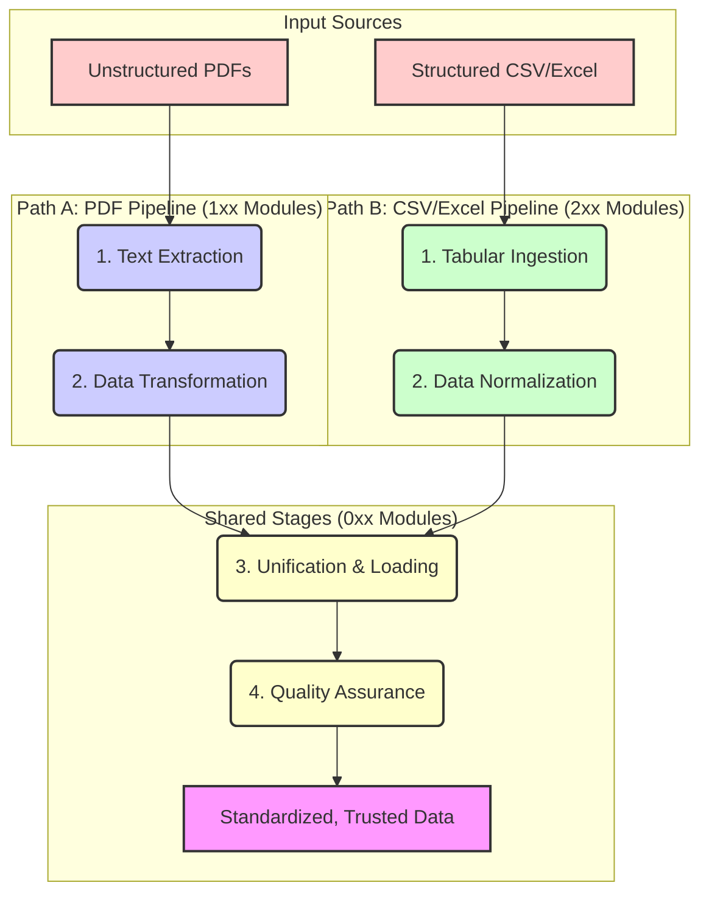

# 🍊 OrangeR: A Commitment to Data Fairness and Accuracy

*Numbers don’t lie, but they do need a good advocate. This package is that advocate.*

I believe that for public institutions to maintain trust, the data they rely on must be impeccable. `OrangeR` is a purpose-driven R package designed to ensure just that. It provides a robust, transparent, and auditable ETL pipeline to transform chaotic, error-prone timesheet data into a source of truth. My goal is to empower organizations to uphold fairness in payroll and ensure accuracy in project accounting through meticulously engineered data systems.

## 🎯 The Mission: From Data Chaos to Institutional Trust

In payroll and labor compliance, the details matter. Messy timesheet data—whether from unstructured PDFs or inconsistent spreadsheets—isn't just a technical problem; it's a fairness problem. It can lead to incorrect payments, compliance failures, and an erosion of trust between employees and institutions.

`OrangeR` was built to solve this. It serves as a dedicated "data refinery," using algorithmic thinking to impose structure and clarity on raw data.

```mermaid
graph TD;
    A[📄 Raw, Unreliable Data <br/> (PDFs, CSVs)] --> B{OrangeR: The Advocate};
    B --> |1. Extract & Structure| C[📝 Validated Data];
    C --> |2. Transform & Clean| D[🧼 Verified & Enriched Data];
    D --> |3. Load & Assure| E[📊 A Single Source of Truth];

    style A fill:#f9f,stroke:#333,stroke-width:2px
    style B fill:#ffc,stroke:#333,stroke-width:4px
    style E fill:#cfc,stroke:#333,stroke-width:2px
```

By automating this process, we achieve:
-   **✅ Unquestionable Accuracy:** Minimizing human error to ensure every detail is correct.
-   **✅ Enhanced Fairness:** Providing a reliable foundation for payroll and compliance.
-   **✅ Meaningful Action:** Freeing up resources from manual data cleaning to focus on analysis and improvement.

## 🏛️ An Architecture of Trust

My dream is to build systems that are as transparent as they are powerful. `OrangeR`'s dual-pipeline architecture is designed for this purpose, handling both unstructured and structured data with precision. Its modularity, enforced by a clear naming convention, ensures that every step is auditable and maintainable.

**`[Layer]_[Subgroup]_[Module]_[Description]_[Version].R`**

This structure allows the system to gracefully handle diverse data sources while maintaining a single, unified standard for the final output.



## 🛠️ Installation

This package is hosted on Azure DevOps. To install it, you will need the `remotes` package and a Personal Access Token (PAT).

```r
# Install remotes if you don't have it yet
if (!requireNamespace("remotes", quietly = TRUE)) {
  install.packages("remotes")
}

# Install from Azure DevOps
remotes::install_git(
  url = "https://dev.azure.com/<organization>/<project>/_git/<repository>",
  credentials = git2r::cred_user_pass("username", "YOUR_AZURE_DEVOPS_PAT")
)
```

## 🚀 Getting Started

Here’s how to run the pipeline and transform your raw data into a reliable asset.

```r
# 1. Load the package (if installed)
# library(OrangeR)

# 2. Define your source and output paths
open_configuration_and_constants()

# 3. Execute the ETL process
run_timesheet_etl(
  source_dir = source_directory,
  output_file = output_path,
  parallel_processing = TRUE # Recommended for large datasets
)

message("✅ Process complete. Your data is now a trusted source, saved at: ", output_path)
```

## 📜 Ethical Engineering Philosophy

I believe that how we build is as important as what we build. `OrangeR` is developed with a philosophy of "ethical engineering" to ensure its output is trustworthy, robust, and maintainable.

-   **Clarity Through Explicit Namespaces:** All external function calls are explicit (e.g., `dplyr::mutate()`). This removes ambiguity and makes the code's dependencies transparent.
-   **Robustness with Modern Tidy Evaluation:** We use `{{ }}` for programming with `dplyr`, creating functions that are both powerful and easy to understand.
-   **Predictability Through Functional Purity:** Functions are designed to be predictable. They take data as input, transform it, and return a *new*, modified data frame, ensuring the original data remains unaltered.
-   **Reliability via Defensive Programming:** Every function validates its inputs using `assertthat::assert_that()`. This ensures functions operate as expected or fail immediately with clear, informative errors, which is critical for building trust in the system.

## 🤝 Let's Collaborate

I am always looking for ways to improve this tool and extend its impact. If you have ideas for new features, encounter a bug, or want to discuss how to apply this to a new challenge, please reach out.

---

*This documentation reflects my commitment to building technology that serves the public good. Always happy to chat.*
